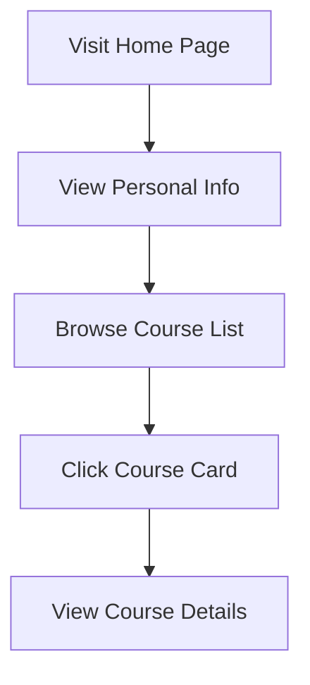

## 1. Product Overview
个人课程展示页面，用于展示广东科学技术职业学院商学院商务数据分析与应用专业学生的课程信息。
- 主要目的是提供一个静态页面，展示学生的课程信息，方便后续补充课程内容。
- 目标用户是学生本人、同学和潜在的雇主，展示学习成果和专业能力。

## 2. Core Features

### 2.1 User Roles
| Role | Registration Method | Core Permissions |
|------|---------------------|------------------|
| Visitor | No registration required | View all course information |

### 2.2 Feature Module
1. **Home page**: Hero section, navigation, course list, personal information

### 2.3 Page Details
| Page Name | Module Name | Feature description |
|-----------|-------------|---------------------|
| Home page | Hero section | Display personal information, major, and academic background |
| Home page | Navigation | Provide links to different sections of the page |
| Home page | Course list | Display multiple courses with basic information, ready for future content expansion |
| Home page | Footer | Contact information and other relevant links |

## 3. Core Process
User visits the home page → Views personal information → Browses course list → Clicks on course cards for more details (to be implemented in future)

## 4. User Interface Design
### 4.1 Design Style
- Primary color: #3B82F6 (blue)
- Secondary color: #10B981 (green)
- Button style: Rounded corners, subtle shadow
- Font: Inter (sans-serif), system fallback
- Layout style: Card-based, clean and modern
- Icon style: Simple, line-based icons

### 4.2 Page Design Overview
| Page Name | Module Name | UI Elements |
|-----------|-------------|-------------|
| Home page | Hero section | Full-width background with personal info, name, major, school, subtle animation |
| Home page | Course list | Grid layout of course cards, each with course name, brief description, hover effect |
| Home page | Footer | Clean layout with contact info, social links, copyright |

### 4.3 Responsiveness
- Desktop-first design with mobile-adaptive layout
- Breakpoints: 1200px (desktop), 768px (tablet), 480px (mobile)
- Touch optimization for mobile devices

### 4.4 3D Scene Guidance
Not applicable for this project.