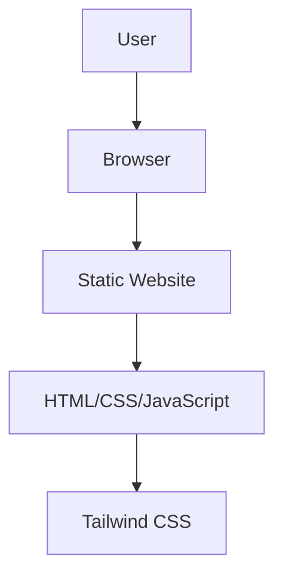

## 1. Architecture Design

## 2. Technology Description
- Frontend: HTML5 + CSS3 + JavaScript
- CSS Framework: Tailwind CSS v3
- Build Tool: None (pure static)
- Deployment: Cloudflare Pages

## 3. Route Definitions
| Route | Purpose |
|-------|---------|
| / | Home page with personal info and course list |

## 4. API Definitions
Not applicable for this static project.

## 5. Server Architecture Diagram
Not applicable for this static project.

## 6. Data Model
Not applicable for this static project.